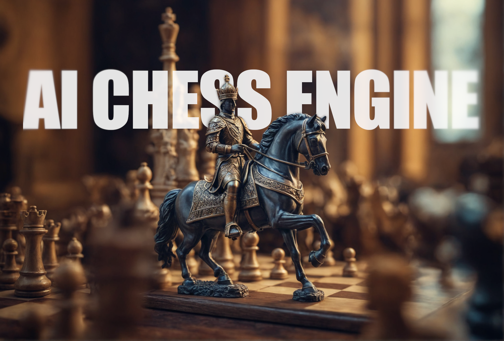
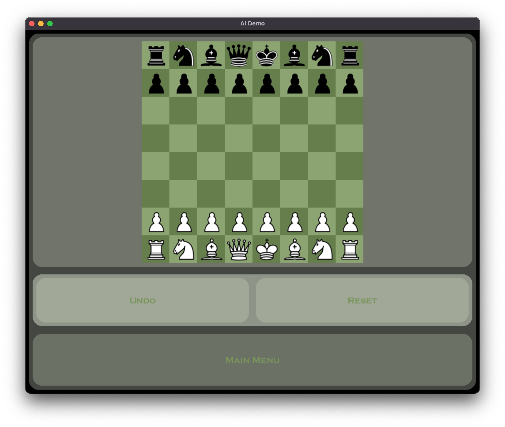
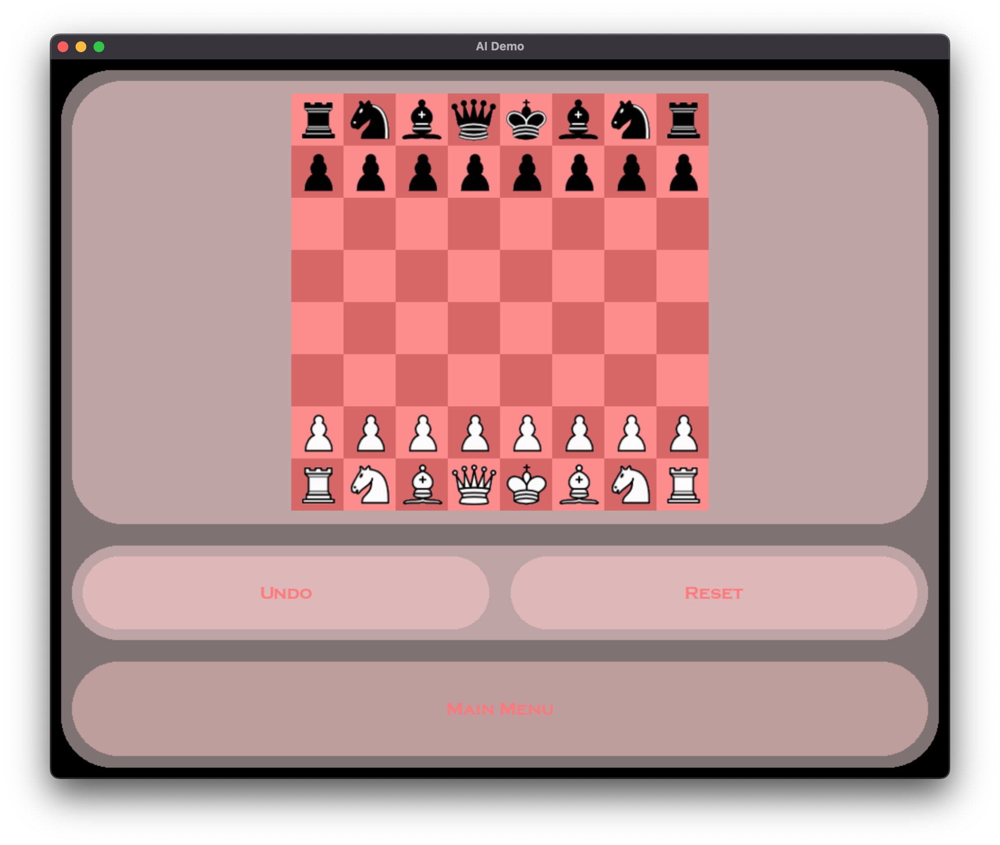
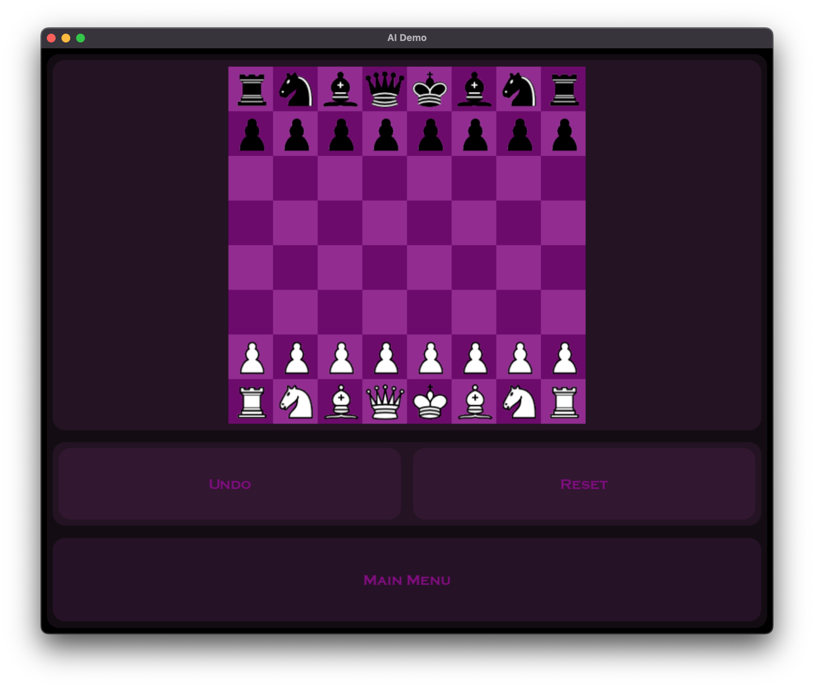
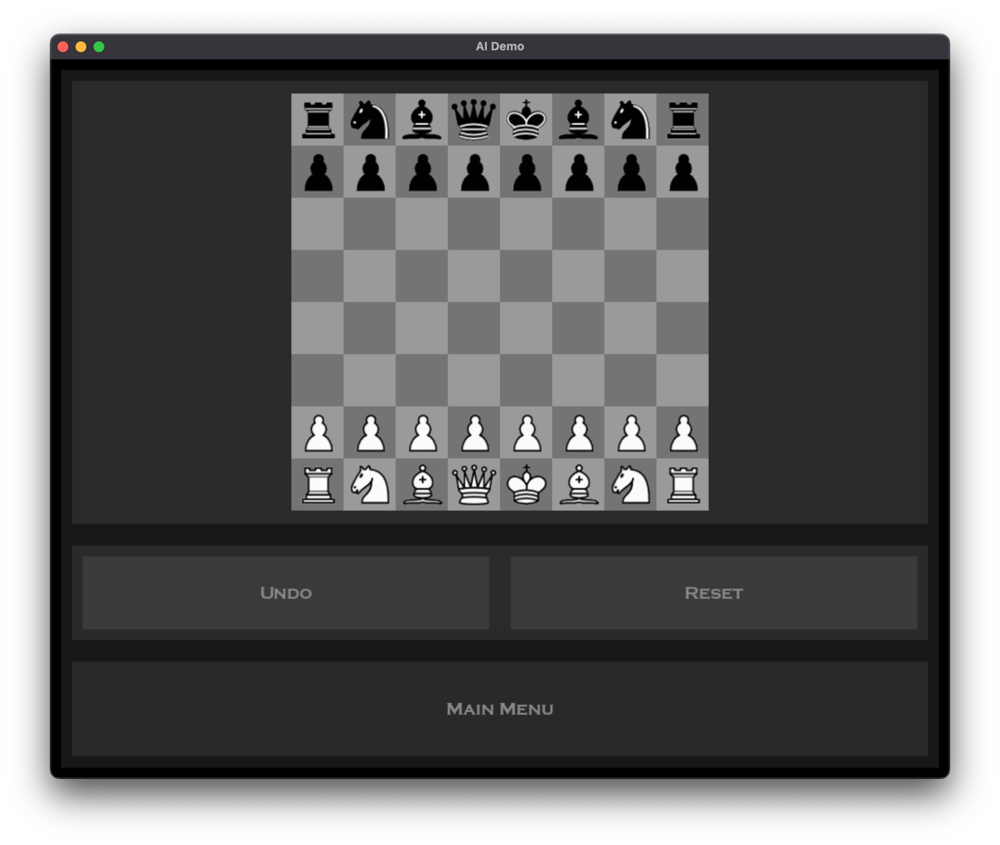

# AI Chess Engine
## About
This is a my practical project for A-Level Computer Science. It is a simple Python implementation of AlphaZero, one of the strongest chess-playing models to date. It utilizes reinforcement learning to train itself, eliminating the need for expensive data and human resources. For more information, please see [DeepMind's blog](https://deepmind.google/discover/blog/alphazero-shedding-new-light-on-chess-shogi-and-go/).

## Preview
For video demo please check out my [testing playlist on YouTube](https://youtube.com/playlist?list=PLFvwr-4vZ5GEFcu4QI-0qTpjvvlAU01-K&feature=shared)

|   |  |
| - | - |
| | |

## Running the Program
### 1. Install dependencies
In terminal, run the following command:
```
pip install pygame torch numpy
```

### 2. Create a .pth file
Before running `main.py`, you need to run `train.py` to create a `.pth` file. This file contains the weight used by the neural network.

### 3. Start the program!
Run `main.py` to enter the main user interface, or run `train.py` to train the model.

